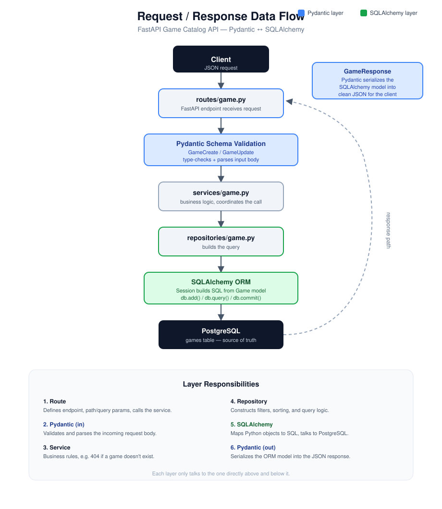
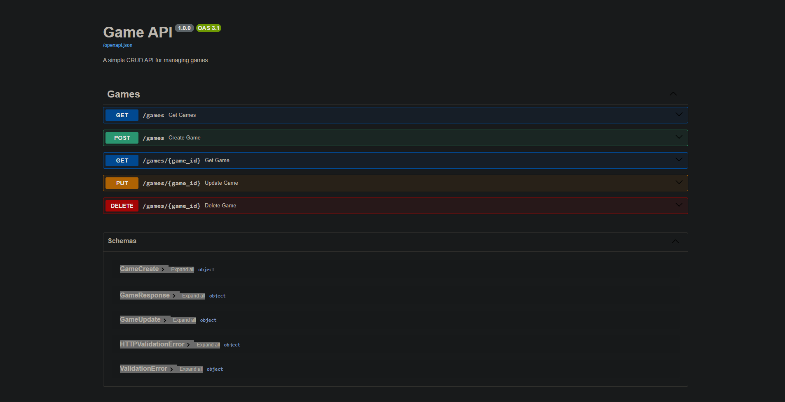

# FastAPI Game Catalog API

A simple FastAPI app for managing games with PostgreSQL, SQLAlchemy, Alembic, and Docker.

## Tech stack
- FastAPI
- SQLAlchemy
- PostgreSQL
- Alembic
- Docker Compose

## Documentation
This project provides a lightweight CRUD API for games with interactive Swagger docs at http://localhost:8000/docs.

### Architecture overview
The diagram below shows the flow of the application layers, from routes to services, repositories, and the database.



### Swagger UI
The image below shows the interactive API documentation generated by FastAPI.



## Run locally

```bash
python -m venv .venv
.venv\Scripts\activate   # Windows
pip install -r requirement.txt
copy example.env .env
docker compose up -d
alembic upgrade head
uvicorn app.main:app --reload
```

Open http://localhost:8000/docs for Swagger UI.

## Docker

```bash
docker compose up --build
```

## Project structure

```text
app/         # routes, services, repositories, schemas, models
migrations/  # Alembic migrations
docs/        # architecture and API docs assets
```

## API

- GET /games
- GET /games/{id}
- POST /games
- PUT /games/{id}
- DELETE /games/{id}
